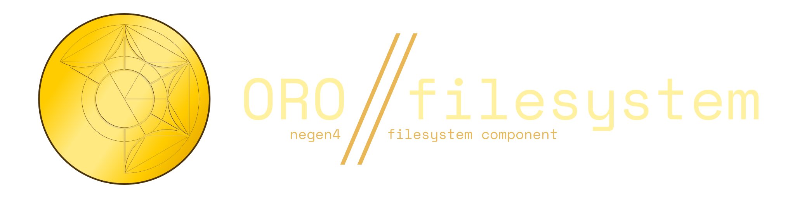

# 

**Obstruction Read-Only Filesystem**.   
A library for accessing packed or unpacked files from the filesystem, ZIP files
or *Obstruction Asset Package*s with a common API.

One of the core components of **Obstruction**.

## Usage

To be decided.

## Obstruction Asset Package

The OAP format is made of two parts: The **package**(s) and the **index**.

> **Note**:  
> OAP is **NOT** compression. It's simply a way of packing several files into
one in a way that is quick to read.  
> It's meant to be used with pre-processed assets that can be directly loaded
into GPU memory, making OAP packages larger than unpacked files.

### The Package

The package is the file where every file is actually stored.  
A game (or other program) can have one or more package but only one **index**.

### The Index

The index is where every file in the package is registered. For simplicity, these
files are JSONs that follow this structure:

```ts
{
    name: "", // empty. The root is always ignored
    files: [
        {
            name: string,
            package: string, // absolute path with this file as the root
            starting_index: number,
            file_size: number
        }
    ],
    directories: [
        {
            name: string,
            files: [],
            directories: []
        }
    ]
}
```


## Aura [TODO]

**Aurum Assets**. Aurum is a web server that allows you to try out mods without
actually installing them. You just tell the game the server's URL and it patches
the files and fetches the files whenever necessary.

It is also based on JSON and follows a similar structure to normal indices, with
the only difference being the `file` object:

```ts
{
    name: string,
    url: string,
    hash: string | undefined
}
```
- **name**: The name of the asset.
- **url**: The URL of the file (raw file data).
- **hash**: An optional field containing the hash of the file (**ALGORITHM TO BE DECIDED**). It ensures that the files haven't been altered since you added the Aura file. It doesn't indicate that a mod is safe and it may not even be what you want, for example in frequently updated mods or for Aurum modpacks that might even depend on more Aura files (likely killing performance).

## FAQ

#### Read-Only? Why?

Because it's meant to be used for packed assets in games.  
During development (while using the engine's editor), files are saved to the
normal filesystem by using the normal filesystem. You don't need a library for
that.